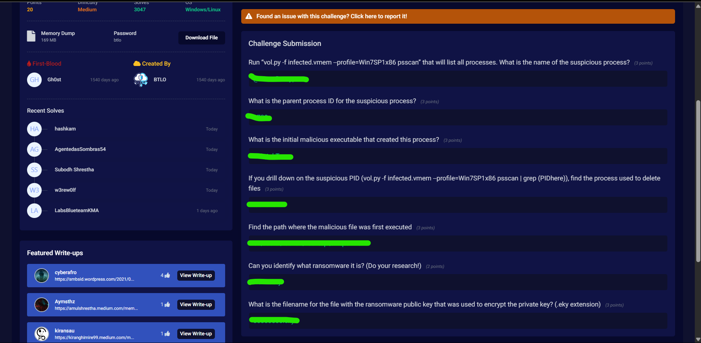

# Memory Analysis - Ransomware
Difficulty: Medium
### Main Tool Used: Volatility3
Details: List of commands I utilized throughout the challenge (not in order):
1. python3 vol.py -f infected.vmem windows.psscan (this command lists all of the processes in the memory)
2. python3 vol.py -f infected.vmen windows.handles --pid [PID] (this command lists all the open handles used by each command)
3. python3 vol.py -f infected.vmem windows.psscan | grep [PID] (we have piped the grep command with the Process ID to filter out all the entry/ies of that PID from the psscan list)
4. python3 vol.py -f infected.vmem windows.cmdline (this lists the command line arguments used to launch each process)

NOTE: I moved the infected.vmem file into my volatility tool's folder for easier access. But in case you haven't done the same, the entire file path should be specified in place of the file name. 

