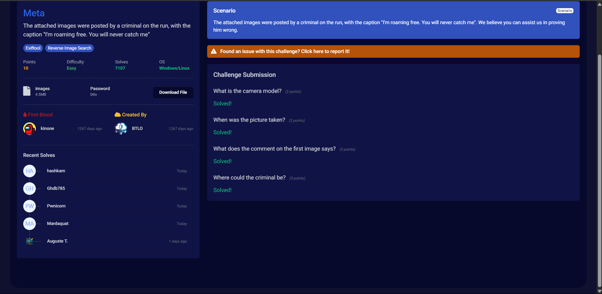

# Meta
Difficulty: Easy

### Tool Used: Exiftool
#### Details:  
1. exiftool [filename.jpg] (helps extract the metadata of the iamge for analyzing)
2. TinEye (website) (used to reverse search the image to find out more details)

